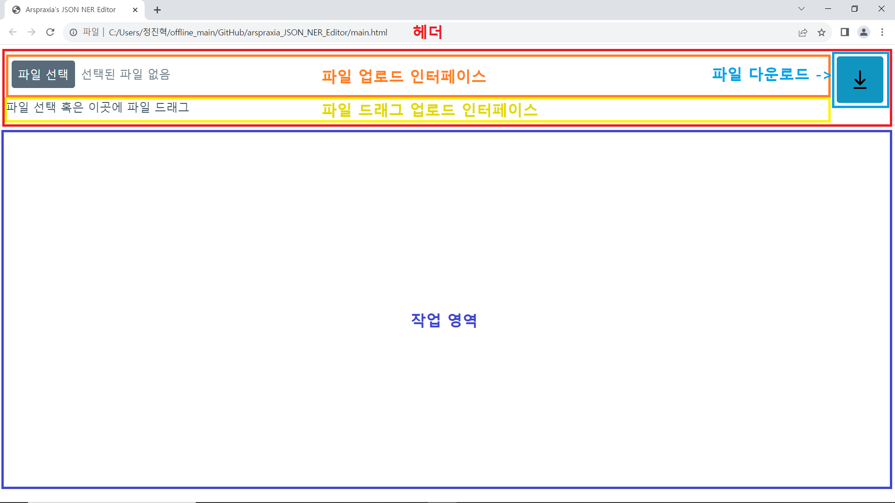
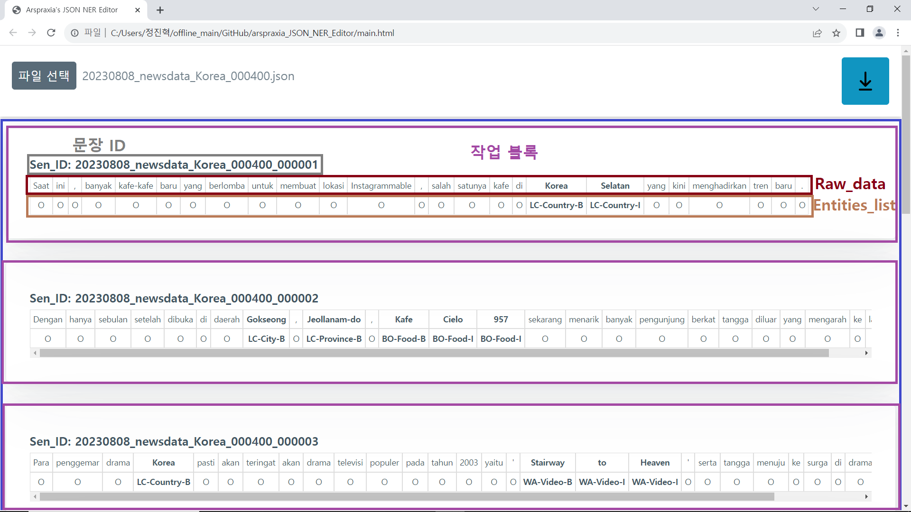
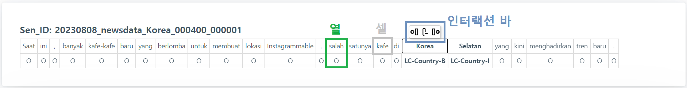
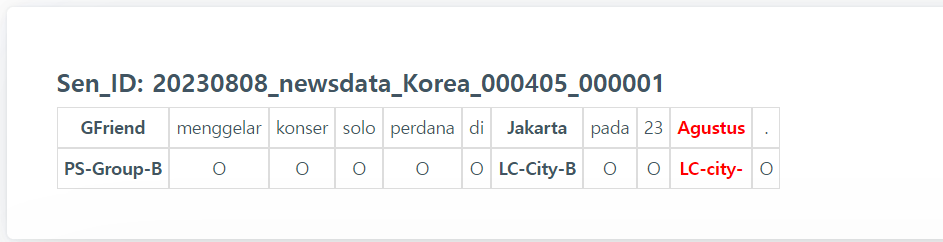

# 개괄
본 프로그램은 arspraxia의 특정 업무 작업을 위해 만든 업무 툴입니다.

## 사용 범위
NIA 인도네시아어 인공지능 데이터 사업의 하위 프로젝트에서 사용해야 합니다.

## 사용 목적
JSON 가공데이터 오류 교정을 위해 만들었습니다.

## 연계 외부 파일
이 툴을 효과적으로 사용하기 위해서는 다음 요소가 필요합니다.

1. 특수하게 규정한 형식으로 NER 태깅되고 가공된 json 데이터
2. 1번 데이터를 기반으로 한 NER 태그별 태깅 위치 기록 파일
3. 1번 데이터를 기반으로 한 NEr 태그별 태깅 횟수 기록 파일

# 설치/실행 방법
1. 초록색 `<> Code` 버튼을 클릭한 뒤 **Download ZIP**을 클릭해 압축파일로 다운로드합니다.
2. 압축을 해제하면 **arspraxia_JSON_NER_Editor-main** 폴더가 생성됩니다.
3. 폴더의 **main.html** 파일을 더블 클릭해 실행하면 됩니다.

# 사용법

1. 문제가 되는 가공 json 파일을 "파일 선택" 버튼을 눌러 선택하거나, 파일을 직접 끌어 옵니다. (파일을 끌어 올 때는 상단 ui에 끌어와야 합니다.)
2. 파일이 적절한 형식을 갖췄으면 작업 공간이 생성됩니다.
3. 문제가 되는 곳의 내용을 수정합니다.
4. 내용을 수정했으면, 오른쪽 상단의 아이콘을 클릭합니다. 작업 공간에 불러온 파일의 이름을 유지한 채, 수정된 사항을 반영한 json 파일을 download 경로로 다운로드합니다.

# UI 얼개

- **헤더(Header)**
    
    >   상단에 위치한 인터페이스입니다.
    
    - **파일 업로드 인터페이스**
        
        >   "파일 선택" 버튼 혹은 인터페이스 아무 곳을 클릭해 파일 탐색기 UI를 불러오고, 파일을 업로드할 수 있습니다.
    - **파일 드래그 업로드 인터페이스**
        
        >   파일을 해당 인터페이스 범위에 드래그-드롭해 파일을 업로드할 수 있습니다.
    - **파일 다운로드 (버튼)**
        
        >   버튼을 눌러 작업 내용이 포함된 파일을 다운로드합니다.
- **작업 영역**
    
    >   불러온 파일을 출력하고, 수정 기능을 제공하는 블록을 담는 영역입니다.

- **작업 영역**

    - **작업 블록**
        
        >   문장별로 `Sen_ID`, `Raw_data`, `Entities_list` 데이터를 불러와 출력합니다. 이 블록의 인터페이스를 통해 데이터를 수정 가능합니다.
        
        - **Raw_data 행**
            
            >   `Raw_data`의 데이터를 토큰 단위로 각 셀에 담은 행입니다.
        - **Entities_list 행**
            
            >   `Entities_list`의 각 요소를 셀에 담은 행입니다.

- **작업 블록**

    - **열**
        
        >   인터랙션 바 기능의 주 단위입니다.
        
        - **셀**
            
            >   표를 구성하는 기초 단위, 출력되는 데이터를 담는 기초 단위입니다.
            
        - **인터랙션 바**
            
            >   셀을 클릭하면 나타나며, 3개의 버튼으로 이루어져 있습니다. 각 버튼은 **왼쪽 열 추가/열 삭제/오른쪽 열 추가** 기능이 있습니다.

# 기능과 주의점
주의점은 :exclamation: 이모티콘으로 표시됩니다.

- 파일 불러오기
    - :exclamation: 파일 드래그-드롭 시 **파일 드래그 업로드 인터페이스** 이외에 파일을 드롭하면 의도되지 않은 결과가 출력됩니다.
    - :exclamation: 작업 파일을 교체하면 이전 작업 내용이 소실되고 즉시 교체된 파일 정보가 불러와집니다.
- 셀 내용 수정
    - 일반 문서 편집기의 표 기능처럼 셀을 클릭해 셀의 내용을 수정할 수 있습니다.
    - Entities_list 행의 셀 내용이 정확한 태그일 경우, 해당 열에 검은 글씨 볼드체가 적용됩니다.
    - Entities_list 행의 셀 내용이 정확하지 않은 태그일 경우, 해당 열에 빨간 글씨 볼드체가 적용됩니다.
    - :exclamation: 내용이 아예 없게끔 (즉, 셀의 내용 전체를 지우는 방식으로) 셀을 수정하면, 작업 파일 다운로드 시 예상하지 못한 오류가 나타날 수 있습니다.
        - 대신 셀 삭제 기능을 이용하기 바랍니다.
- 열 삭제
    - 셀을 클릭하면 셀 상단에 작게 인터랙션 바가 등장하고, 인터랙션 바 내부에는 3개의 아이콘이 가로 일렬로 정렬되어 있습니다.
    - 이 중 가운데 아이콘을 클릭하면 클릭한 셀을 기준으로 열 삭제가 이루어집니다.
    - :exclamation: **삭제 시 경고 문구가 없기 때문에**, 꼭 필요할 때만 열을 삭제해야 합니다.
    - :exclamation: 작업 블록에 열이 1개 있을 시, 열 삭제가 불가능합니다.
- 열 추가
    - 셀을 클릭하면 셀 상단에 작게 인터랙션 바가 등장하고, 인터랙션 바 내부에는 3개의 아이콘이 가로 일렬로 정렬되어 있습니다.
    - 이 중 왼쪽 아이콘을 클릭하면 클릭한 셀의 열을 기준으로 왼쪽 열이 추가되고, 오른쪽 아이콘을 클릭하면 클릭한 셀의 열을 기준으로 오른쪽 열이 추가됩니다.
    - 열 추가 시 `Raw_data` 부분(1행)은 `-` 문자가, `Entities_list` 부분(2행)은 `O` 문자가 기본값으로 입력됩니다.
- 작업 파일 다운로드
    - 헤더 오른쪽의 파란색 아이콘을 클릭하면 현재 작업 내용을 반영한 데이터가 작업 중인 파일명으로 다운로드됩니다.
    - 다운로드 경로는 Windows 한국어 환경 기준으로 `내 PC\다운로드`(`C:\Users\(사용자명)\Downloads`)입니다.
- 기타 주의사항
    - :exclamation: NER Editor 작업 영역에서 하는 작업은 원본 파일의 데이터에 영향을 미치지 않습니다.
    - :exclamation: 되돌리기(ctrl + z), 되돌린 작업 다시 되돌리기(ctrl + y) 등의 유틸 기능은 지원하지 않습니다.
    - :exclamation: F5(새로고침) 키를 누르면 **모든 작업 내용이 삭제되고 파일이 업로드되지 않은 초기 상태**로 되돌아갑니다.

# 부정확한 태깅 시

Entities_list 행의 셀이 정확한 태그가 아닐 경우 해당 열을 빨간 글씨로 부각

